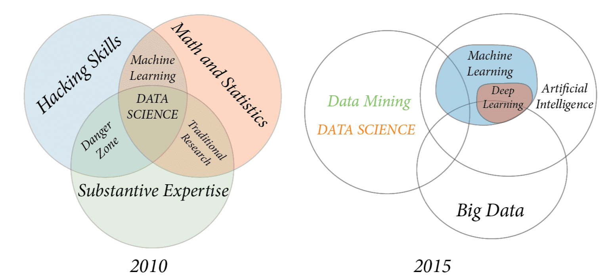
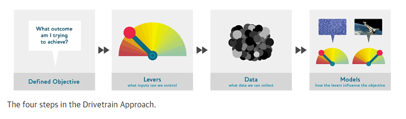
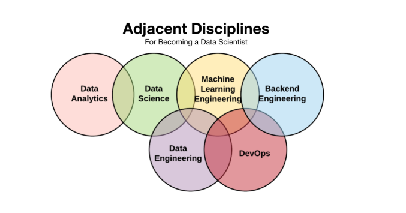
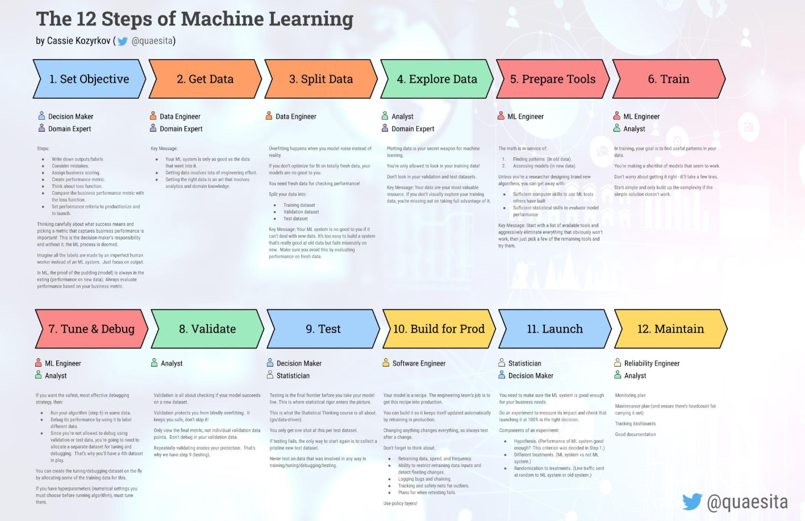

## The definition of data science is evolving

*Evolution of data science venn diagram* [source](https://s3.amazonaws.com/assets.datblog_assets/DataScienceEightSteps_Full.png/)

Data science combines domain expertise, programming skills, and machine learning to extract meaningful insights from data that business users can translate into a tangible business value. 

In practice, however, data science is concerned with any activity that involves turning data into an actionable insight leading to either a **product** or a **solution** that adds business value. Data are usually of bigger size (relatively) and could include both structured (table-like) or unstructured (text, imagery, log data etc.) types.

## Data science practice is evolving too

####  Data science is increasingly considered as a processual lifecycle of ideation, product development, deployment, and continuous monitoring.

Product development step in itself consists of a four-step project ([Drivetrain Approach](https://www.oreilly.com/radar/drivetrain-approach-data-products/)). The role of data science practitioners overlap in all the four steps of product development. Primarily, they spend significant amount of time in the following: Asking right questions; framing business problems; understanding dataset; applying skills to ingest data from a variety of sources; cleaning; and transforming messy data before model development. As such, building a model is only one piece of the complex system that makes up a full data product. Successful product development and deployment requires data scientists to constantly engage with business function and collaborate with data governance team, data team, data engineers, and IT professionals. Finally, data scientists are responsible for continuous performance monitoring; and in case in which there is a dip in performance levels, redesigning and rebuilding the product.

### Companies are looking for data scientists that have skillsets in most or all of the following domains

- Statistics and Machine Learning
- Programming
- Big data technologies
- Distributed and parallel computing
- Cloud computing
- Interacting with RESTful APIs
- Database

Companies are increasingly looking for full-stack data scientists who can can put together a project from end-to-end or, at least, can work very closely with data engineers and IT professionals.

Data science product or solution mostly ends up being a software, which fits into the larger ecosystem of IT infrastructure. As such, data scientists need to understand how these different pieces work together as well as how best to communicate using library calls, REST APIs, and  database queries, etc. 

It is about time that data scientists go beyond the core data science and machine learning skills in order to begin to work on building and improving skills from adjacent disciplines. 

*Adjacent disciplines for data scientists* [Source](https://medium.com/@rchang/how-i-build-learning-projects-part-i-54dbaad68961)

## What is this course about ?

This course focuses on end-to-end implementation of a data science project that employs machine learning based modelling tools. Data science is a huge field, and machine learning is one among the many tools available. Understanding the concepts and practices of implementing a complete machine learning workflow will help students undertake similar endeavors using other tools as well.

This course will focus on teaching students about all the 12 steps of applied machine learning and artificial intelligence project roadmap discussed by Cassie Kzyrkov (head of Decision Intelligence, Google) [here](https://medium.com/swlh/12-steps-to-applied-ai-2fdad7fdcdf3) including the best practices in the implementation of the steps. 

*12-steps-machine-learning-workflow* [source](https://medium.com/swlh/12-steps-to-applied-ai-2fdad7fdcdf3)

## Further readings:

[What do machine learning practitioners actually do](https://www.fast.ai/2018/07/12/auto-ml-1/)

[12 Steps to Applied AI](https://medium.com/swlh/12-steps-to-applied-ai-2fdad7fdcdf3)

[Designing great data products](https://www.oreilly.com/radar/drivetrain-approach-data-products/)

[How I Build Learning Projects](https://medium.com/@rchang/how-i-build-learning-projects-part-i-54dbaad68961)

[What is hardcore data science in practice](https://www.oreilly.com/radar/what-is-hardcore-data-science-in-practice/)

[Software is eating data science work](https://yanirseroussi.com/2020/01/11/software-commodities-are-eating-interesting-data-science-work/)

