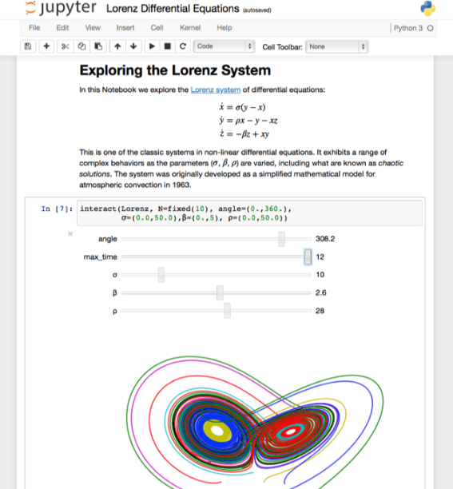
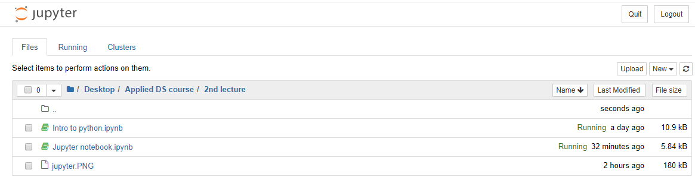
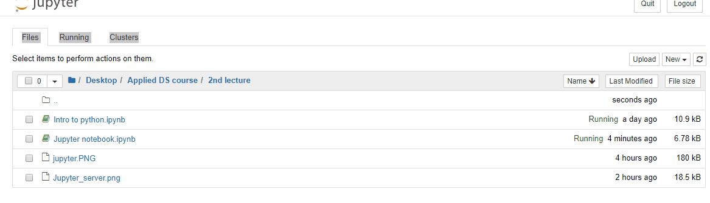
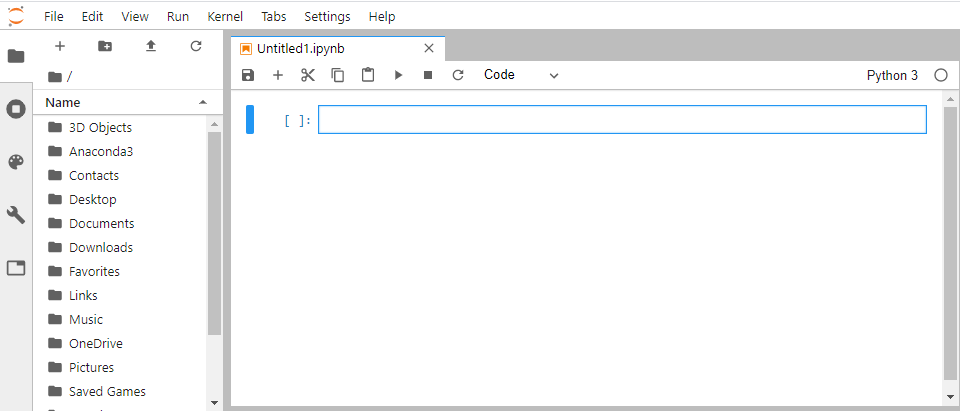

## The Jupyter Notebook

- Jupyter Notebook is maintained by Project Jupyter that develops open-source software, open-standards, and services for interactive computing across many programming languages.

-  Notebook is an open-source web application that allows us to create and share documents that contain live codes, equations, visualizations, narrative texts, etc.

- Uses include: data cleaning and transformation, numerical simulation, statistical modeling, data visualization, machine learning, and much more.

- Allows for interactive developing and presenting data science projects: It has become a massively popular tool for doing research-oriented interactive developing in Python as well as for presenting data science projects.

- Enables the [reproducibility](https://www.dataschool.io/reproducibility-is-not-just-for-researchers/) aspects of science in data science. 

As visualization can be embedded within a notebook, and blocks of Markdown-formatted text can be written, all lecture materials, tutorials, and assignments for this course are developed with Jupyter Notebook.




## Installation

The easiest way to get started with Jupyter Notebook is by installing Anaconda. Refer to the Python installation section [here](https://github.com/abanskota/t81_577_data_science/blob/master/weekly_materials/week1/docs/python-introduction-and-set-up.md) for Anaconda installation if you haven't done yet.

If you plan to create a separate project environment and manage and install packages manually, first activate the environment in your terminal. Then install the Jupyter Notebook using:

``` shell
conda install jupyter
```

## Starting a Jupyter Notebook Server

Open up your terminal application or anaconda prompt and go to a folder of your choice and run the following command:

```shell
jupyter notebook
```

This will start up Jupyter and your default browser should start (or open a new tab) to the following URL: http://localhost:8888/tree

Your browser should now look something like this:



## Creating new notebook and running command in a cell



Menu items are self explanatory. Here are few general tips:

- Toggle to *markdown* to change the cells as markdown type
- Learn some tips, tricks, and shortcuts from [here](https://www.dataquest.io/blog/jupyter-notebook-tips-tricks-shortcuts/).
- On the notebook server page, check on the box on the left side of the notebook to shut it and double click the file name to restart.

## Jupyter Lab

- Jupyter lab is the next generation of Jupyter notebook and provides an improved interface over the notebooks.

- It offers a general framework for interactive computing and data science in the browser, using Python, Julia, R, or one of many other languages, but we will focus on Python here.

- Jupyter lab also brings within the same interface a file browser, consoles, terminals, text editors, Markdown editors, CSV editors, JSON editors, interactive maps, widgets, and so on. The architecture is completely extensible and open to developers. In a word, JupyterLab is a web-based, hackable IDE for data science and interactive computing.

- Jupyter lab is fully compatible with the existing notebooks and kernel and can run side by side on the same computer. One can easily switch between the two interfaces.


## Installation

Jupyter lab also comes with standard anaconda distribution. As with notebook, jupyter lab can also be installed using conda or pip. 

Type the following command in the terminal:

```python
conda install -c conda-forge jupyterlab
```


## Running

Start up Jupyter lab by typing the following in the terminal:
```shell
jupyter lab
```
This will start up Jupyter lab, and your default browser should start (or open a new tab) to the following URL: http://localhost:8888/tree

Your browser should now look something like this:




Some useful resources for learning tips and tricks using Jupyter

https://realpython.com/jupyter-notebook-introduction/

https://www.datacamp.com/community/tutorials/tutorial-jupyter-notebook
    
https://www.pythonlikeyoumeanit.com/Module1_GettingStartedWithPython/Jupyter_Notebooks.html


```python

```
