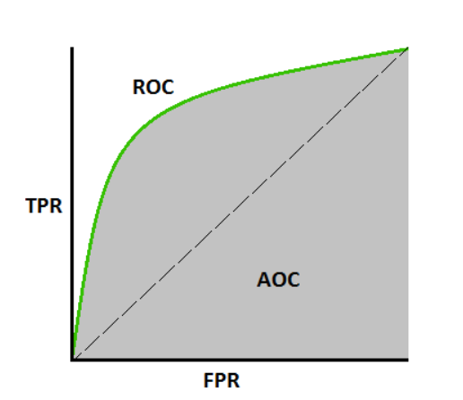
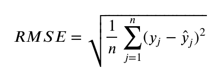
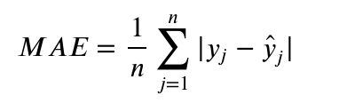

How can we get an unbiased estimate of the accuracy of a learned model?


## Evaluation metrics for classification


### Confusion matrix

Confusion matrix is a square matrix that reports the counts of the `true positive`, `true negative`, `false positive`, and `false negative`.

It is easy to create a confusion matrix in Scikit-learn:

```python
from sklearn.metrics import confusion_matrix
confusion_matrix = confusion_matrix(y_test, y_pred)
print(confusion_matrix)

[[14  0  0]
 [ 0 17  1]
 [ 0  1 12]]
```


[Image source]

From the confusion matrix we can derive a number of other model performance metrics.

**Accuracy**: 

Accuracy is defined as the sum of correctly classified cases versus total cases. It simply measures how often the classifier makes the correct prediction.

Accuracy = (TP + TN) / ( TP + FP + TN + FN)

`True Positives` (TP):  Observed class 1 , predicted class 1

`True Negatives` (TN):  Observed class 0 , predicted class 0

`False Positives` (FP): Observed class 0 , predicted class 1

`False Negatives` (FN): Observed class 1 , predicted class 0

Accuracy may not be useful measure in cases when:

- Test dataset is imbalanced
- There are differential misclassification costs i.e. getting a positive wrong is costlier than negative
- When we are most interested in a subset of high-confidence predictions 


**True positive rate (TPR)**

- Also called `recall` and `sensitivity`
- A ratio between true positive and total number of  positive cases

TPR = TP / (TP + FN)

**False positive rate (FPR)**

False positive rate is the ratio between false positive and total number of negative cases

FPR = FP/ (FN + TN)

**Receiver Operating characteristics(ROC) and Area under ROC Curve(AUC)**

ROC curve is a graph that shows how the performance of a binary classification system varies with prediction threshold. The ROC curve is obtained by plot between true positive rate(TPR) and false positive rate(FPR) at different thresholds. 

Area under ROC Curve (AUC) is a metric for measuring the ability of a binary classifier to discriminate between positive and negative classes. This is one of the most popular metrics in industry probably owing to its insensitivity to class imbalance.



[image source](https://towardsdatascience.com/understanding-auc-roc-curve-68b2303cc9c5)

A perfect model has AUC 1, whereas a poor model has AUC close to 0.

**Precision**

- The fraction true positives among all predicted positives.
- Out of all predicted items, how many were actually positives? 

Precision = TP/(TP + FP)

**Recall**

- Fraction of true positives among all positive examples
- How many positive examples were actually _recalled_ as positives by classifier? Out of all the positive examples, how many were predicted positive by the classifier?

same as TPR

Recall = TP /(FN + TP)

F1 ratio combines both precision and recall in its formulation. The score lies in the range o and  with 1 being ideal and 0 being the worst. 

F1 = 2 * (Precision*recall)/(precision + recall)

According to Wiki,

```David Hand and others criticize the widespread use of the F1 score since it gives equal importance to precision and recall. In practice, different types of mis-classifications incur different costs. In other words, the relative importance of precision and recall is an aspect of the problem.```


print(metrics.classification_report(y_test, y_pred))

### Evaluation metrics for regression


**RMSE (Root Mean Square Error)**

RMSE is the most widely used measure of the differences between predicted and observed values in a regression problem in machine learning. It’s the square root of the average of squared differences between prediction and actual observation.



Since the errors are squared before they are averaged, the RMSE gives a relatively high weight to large errors. This means the RMSE should be more useful when large errors are particularly undesirable. But for the same reason, they tend to be dominated by outlying estimates far away from the true value.

**Mean Absolute Error (MAE)**

MAE is the average of the absolute difference between the predicted values and observed values. Compared to RMSE, MAE is more robust i.e. less sensitive to outliers.




