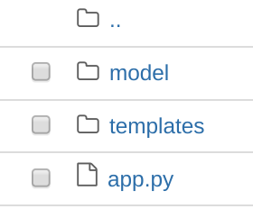

### Deploying a ML model as a service


In the traditional ML developement framework, once a good model is found, it needs to be deployed to generate any value out of the model. At this stage, data scientists typically tend to feel that their job is mostly done. However, we soon realize that the running model in personal computer or in analytics environment is completely different from that in production envrionement. Data scientists experience a lot of friction points mainly becuase the model has to be adapated to the production environment. On top of that the model also needs to undergo various testing procedures to ensure the results are replicated from development environment. 

In the more contemporary approach of continious delivery (CD4ML), the model building and deployment is a continious process and models are released at very early stage and are continiously improved and deployed at short increment cycle. In this framework, the model deployment is even more cross functional process where the data scientist's rols is tightly coupled with IT operations.

Data scientists can contribute to smooth operationalization of the model deployment operation by being a keen obser. It doesn't mean that the data scientist must know all the nitty gritty of productionizing model. Having a general understading of the process can help us develop a production mindset right from the start.

In this lecture, you will learn we will learn to deploy a simple model (without online training, autoML, and batch prediction features) that can be deployed on the web. User can provide input for the features of your model one at a time to generate predictions. In the next lecucture, we will learn about tranforming the whole model pipeline into production workflows using a workflow mangement program - Airflow.

https://towardsdatascience.com/deploying-keras-deep-learning-models-with-flask-5da4181436a2


## Train and save a ML model

Let's train a very simple model using Boston Housing dataset that we have been using for the past few weeks. Let's create a regression model using random forest to predict the house price using all the features in the dataset. We don't care here about the model performace at this point, as our goal is to learn how to deploy a model on the web.

```python
from sklearn.datasets import load_boston
from sklearn.ensemble import RandomForestRegressor
boston_dataset = load_boston()
X = boston_dataset.data
Y = boston_dataset.target
rf = RandomForestRegressor()
rf.fit(X, Y)
```

The model that we built with the above codes need to be first saved as a pickle object.

```python
import pickle
with open('./model.pkl', 'wb') as model_pkl:
  pickle.dump(rf, model_pkl)
```

Pickling converts the object into a byte stream which can be stored, transferred, and converted back to the original model at a later time. It provides a convenient way of storing machine learning models when their intended applications is also built in python. As a sidenote, there might be many other ways you are going to use you model object depending upon downstream platforms and applications.

- MLeap provides a common serialization format for spark , scikit-learn, and Tensorflow models
- PMML , PFA, ONNX are language agnostics exchange formats to share models
- Cloud provider have tools and SDKs to wrap your model to deploy into their machine learning platforms, such as Azure ML, AWS Sagemaker, or Google AI. 
- Other option is to use tool like Kubeflow and airflow, which are particularly suited for models that need to be continiously trained upon and has to solve many problems apart from serving the model.

## Create  a web app with Flask

There are two parts of a web app:

**Front end** The UI part built upon several things: HTTP, HTML, javscript, CSS, and so on.

** Back end** 

Back-end Development refers to the parts of the website that a user doesn’t see or directly interact with. The back end handles application logic, algorithms, database interaction and the processing of user requests. 

#### What is Flask?

It makes the process of designing a web application simpler. Flask lets us focus on what the users are requesting and what sort of response to give back. There are many other webframeworks but Flask is probably the most simplest for our purpose.

There are front-end related things also we need to put together to build a web app that we will deal in later. First, we will focus on the backend that could be deployed as a local server in your own computer.


Let's start with creating a new python file and type in the following command to import modules from flaks library.

```python
from flask import Flask, request
```

Initialise a new Flask object to a variable called app. 
```python
from flask import Flask, request

app = Flask(__name__)
```

Add the two lines of codes to read the pickle file you saved previously. Make sure the pickle file is in the current directory, and you added the line to iport pickle too. 

```python
from flask import Flask, request
import pickle

with open('./model.pkl', 'rb') as model_pkl:
    rf = pickle.load(model_pkl)

app = Flask(__name__)
```

Now add a function to predict that takes the input for Boston housing models and return the prediction. At this point, I realize that I should have picked only few important variables to avoid a lot of coding here. Anayway, this function will act as an enpoint of the API we are going to built.  

``` python
import numpy as np
from sklearn.ensemble import RandomForestRegressor
def predict_boston():
    # Read all necessary request parameters 
    # Read all necessary request parameters 
    CRIM = request.args.get('CRIM')
    RM = request.args.get('RM')
    AGE = request.args.get('AGE')
    DIS = request.args.get('DIS')
    

    # prediction for new data
    unseen = np.array([[CRIM, RM, AGE, DIS]])
    result = rf.predict(new)
    # return the result back
    return 'The predicted price the Boston house with CRIM = {}, and RM = {}, and AGE = {}, and DIS = {} is : {}'.format( \
        unseen[0][0], unseen[0][1],unseen[0][2],unseen[0][3],result)
```

Let's put the above code inside our script and map this function to a URL. This can be done through
app routing `@app.route('/predict')` as shown below. This tells that predict function is registered as an api endpoint, and if we visit the `/predict` url, the output of that function is rendered on the browser's screen.

```
import pickle
import numpy as np
from sklearn.ensemble import RandomForestRegressor
from flask import Flask, request

app = Flask(__name__, template_folder='templates')
with open('./model.pkl', 'rb') as model_pkl:
    rf = pickle.load(model_pkl)

# Create an API endpoint
@app.route('/predict')
def predict_boston(): 
    # Read all necessary request parameters 
    CRIM = request.args.get('CRIM')
    RM = request.args.get('RM')
    AGE = request.args.get('AGE')
    DIS = request.args.get('DIS')
    
    # prediction for new data
    unseen = np.array([[CRIM, RM, AGE, DIS]])
    result = rf.predict(new)
    
    # return the result back
    return 'The predicted price the Boston house with CRIM = {}, and RM = {}, and AGE = {}, and DIS = {} is : {}'.format( \
        unseen[0][0], unseen[0][1],unseen[0][2],unseen[0][3],result)

if __name__ == '__main__':
    app.run()
```
Save the above script as `main.py` and run the script using python interpretor:

`python main.py`

By default, this Flask app will start up at localhost (127.0.0.1) and listen for requests at port 5000.

Send the following `GET` request to the API using `Curl` or `Postman` or type in your broswer to receive the predicted price of the house 

```bash 
http://127.0.0.1:3000/predict?CRIM=0.0006&RM=6.5&AGE=65&DIS=5
http://localhost:5000/predict?CRIM=0.0006&RM=6.5&AGE=65&DIS=5
```

It should return something like this:

```bash
The predicted price the Boston house with CRIM = 0.0006, and RM = 6.5, and AGE = 65, and DIS = 5 is :
```


We deployed our model on local server and accessed it with web clients to get the results. At this stage,  We need to do few more things to deploy it into the web.

we need to slighly modify the Python code, rename the file, and create folders to put model and HTML templates. A template is a document that helps us render a `form` to enable users to input their own data and retrieve model prediction results. For a Flask web application, we can use the Jinja templating library to pass Python code to an HTML document. For example, in our main function, we’ll send the contents of the form to a template called main.html.

Add a `main()` function as below to the `main.py`. The app routing decorator maps base URL `'/'` to the main function that returns the content inside the `main.html` file. Make sure to import `flask`, previously 
you might have only imported a couple of models from the library. Look into the app.py in the webapp folder of this week lecture if needed.

```Python
@app.route('/')
def main():
    return(flask.render_template('main.html'))
```
We haven't yet created the html.file. For now, just type the following in a text file and save the file inside `template` folder as `main.html`. 

```html
<!doctype html>
<html>
<head>
<title>FirstWebApp</title>
</head>
<h1>This is my first web app with Flask.</h1>
</html>
```

Create a model directory and put the pickled model inside the model directory.

Now your folder structure should look like this. The `template` folder consists of the `main.html`, and the `model` folder has `model_pkl`.




To test, if it is working until now, open your we browser and type `http://localhost:5000/`, it should render the content in your html.

Now add more content to the html file to enable a user to fill out a form with input values of a Boston house to obtain its predicted price.
Once the user enters the information and hits submit (a POST request), we want to divert the input to the `predict` function to make predictions with our model.

Flask will extract the data from the form with the flask.request.form functionality, which works like a dictionary. We can grab the data we want from the form by referring it to the name. This name will be set in the main.html template as below.

The `action` attribute in the `form` tag tells flask to go to the URL and related function when the user submits the form. In this simple app, we just want the main function. The POST method tells that function that it should expect input and therefore process it.`


```html
<!doctype html>
<html>
<head>
<title>T81_577</title>
</head>
<h1>Boston house price model app.</h1>
<form action="{{ url_for('main') }}" method="POST">
    <fieldset>
        <legend>Input values:</legend>
        CRIM:
        <input name="CRIM" type="number" required>
        <br>
        <br> ZN:
        <input name="ZN" type="number" required>
        <br>
        <br> INDUS:
        <input name="INDUS" type="number" required>
        <br>
        <br>
        CHAS:
        <input name="CHAS" type="number" required>
        <br>
        <br> NOAX:
        <input name="NOAX" type="number" required>
        <br>
        <br> RM:
        <input name="RM" type="number" required>
        <br>
        <br>
        AGE:
        <input name="AGE" type="number" required>
        <br>
        <br> DIS:
        <input name="DIS" type="number" required>
        <br>
        <br> RAD:
        <input name="RAD" type="number" required>
        <br>
        <br>
        TAX:
        <input name="TAX" type="number" required>
        <br>
        <br> PTRATIO:
        <input name="PTRATIO" type="number" required>
        <br>
        <br> B:
        <input name="B" type="number" required>
        <br>
        <br>
        <br>
        <br> LSTAT:
        <input name="LSTAT" type="number" required>
        <br>
        <br>
        <input type="submit">
    </fieldset>
</form>
<br>

</html>
```

Modify the `app.py` by making following changes.

- Copy the contents of the `predict` function and put them inside the `main()` function.

- Map the main function to the base URL of the api that can handle `GET` and `POST` HTTP method. This enables flask to receives a POST request when a user submits the form with input information. The app will then extracts the input, runs it through the model and will finally render main.html with the results in place. 

```Python

import pickle
import numpy as np
from sklearn.ensemble import RandomForestRegressor
from flask import Flask, request
import flask

with open('./model/model.pkl', 'rb') as model_pkl:
    rf = pickle.load(model_pkl)

app = Flask(__name__, template_folder='templates')


@app.route('/', methods=['GET', 'POST'])
def main():
    
    if flask.request.method == 'GET':
        return(flask.render_template('main.html'))
    
    if flask.request.method == 'POST':
        CRIM = request.form['CRIM']
        RM = request.form['RM']
        AGE = request.form['AGE']
        DIS = request.form['DIS']
       

        unseen = np.array([[CRIM, RM, AGE, DIS]])
        print(unseen)
        result = rf.predict(unseen)

        return 'The predicted price the Boston house with CRIM = {}, and RM = {}, and AGE = {}, and DIS = {} is : {}'.format(unseen[0][0], \
            unseen[0][1],unseen[0][2],unseen[0][3],result)
            
if __name__ == '__main__':
    app.run()
```

If you have followed everything correctly so far, you should have an app with basic functionality to interact with user for input and returning back the model prediction. You can chek this with `flask run` command and opening the related url on your browser.

### Deploy web-app to Heroku

Now we will deploy the model app on Heroku, which is a palatfom as a service (PaaS)that lets developers deploy their application amongst other things. To deploy on Heroku, you need to follow more steps:

#### 1. Create a requirements.txt file in the folder with following contents.

```python
flask
gunicorn
sklearn
numpy
```

#### 2. Create a text file named `Procfile` and type the following there. 

```bash
web: gunicorn app:app
```
 Procfile specifies the commands that are executed by the app on startup and tells Heroku what kind of app you are running and how to serve it to users. 
 
 #### 3. Create a git repository , and push it to github 
 
 #### 4. [Sign up for a free Heroku account](https://signup.heroku.com/signup/dc)
 
 #### 5. [Install Heroku CLI tool](https://devcenter.heroku.com/articles/heroku-cli#download-and-install)
 
 #### 6. Create an app at Heroku site, and link it to the github repo.
 
 #### 7. Login to Heroku from your  terminal.
 
 ```heroku login``
 
 #### 8. Type the following to create 
 ```bash
 heroku create <your-model-name>
 ```
 ```bash
 heroku git:remote -a <your-model-name>
 git push heroku master
 ```
 
Congratulation, your machine learning model is now being served via web!
 
 
