## Common machine learning algorithms: Part I

In [Week 4](https://github.com/abanskota/t81_577_data_science/blob/master/weekly_materials/week4/docs/types-by-framework.md), we learnt some distinctions between statistical modelling and machine learning framework. We also learnt that machine learning models could be broadly categorized into supervised, unsupervised, and reinforcement learning models. In this section you will have a high level overview on some of the most common machine learning algorithms. This is the part I of the introduction to the machine learning algorithms. In the next week, we will cover some additional algorithms.

[1. Linear regression?](#linear-regression?)<ul><li>[1.1. Ordinary least-square regressions](#ordinary-least-square-regression)  <li>[1.2. Linear regression with regularization](#linear-regression-with-regularization) <ul><li>[1.2.1 Ridge regression](#ridge-regression) <li>[1.2.2. Lasso regression](#lasso-regression)</ul></ul><li> [2. Logistic regression](#logistic-regression) <li>[3. Naïve Bayes classifier algorithm](#naïve-bayes-classifier-algorithm) <li>[4.Tree based algorithms](#tree-based-algorithms)<ul><li>[4.1 Bagging](#bagging) <li>[4.2 Random Forests](#random-forests) <li>[4.3 Boosting](#boosting)</ui><li>[5. K-means clustering](#k-means-clustering)
    
## Linear Regression

In supervised learning, the goal is to learn a function f : X → Y given data so that f(x) is a “good” predictor for the corresponding value of y. When the target variable that we’re trying to predict is continuous, the learning problem becomes a regression problem. 

Linear regression consists of a family of linear techniques to build regression models. In a univariate regression, a regression line describes how a response variable linearly changes as explanatory variable changes. In higher dimensions with multiple explanatory variables, linear regression problem amounts to finding a plane or a hyper-plane. 

### Ordinary least squares regression

**Note:** _We will not be covering all the nuances of least squares regression including the underlying assumptions, which are critical when the meaning(interpretability) of the model coefficients are desired.  We are just treating the linear regression here as another data mining algorithm in order to set the foundation for discussion of machine learning techniques._

Linear regression between a continuously valued response (target variable y) and a set of explanatory variables (x0, x1, x2…...xm) can be defined as follows:

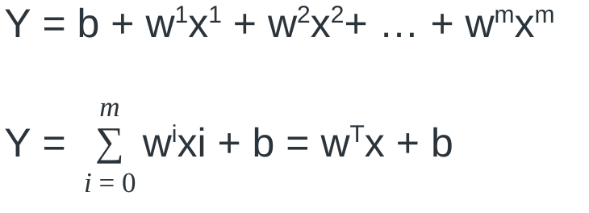

,where b is the y-axis intercept, and w1 ... wm are the coefficients of the corresponding explanatory variables. The goal of a learning algorithm is to learn the set of coefficients or weights that best describe the linear relationship between X and y variables in the training data that can be accurately used to predict the value of y in future data.

When the best line is determined using a technique called least square, the linear regression is known as the least square regression or ordinary least square regression. The least square regression fitting procedure involves a loss function, known as residual sum of squares or RSS of the differences between true y value and estimated values. 

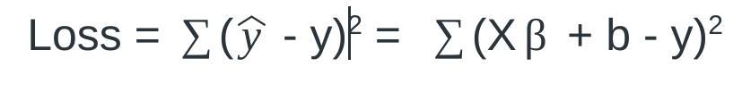

The coefficients are chosen, such that they minimize this loss function.

**Note:** _It is common in machine learning to refer to the error between yhat and y of a single training observation as `loss function`, and the cumulative error over the entire dataset as `cost function`._

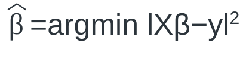

The least square problem can be analytically solved with the following equation:

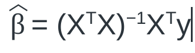

However, when there are a very large number of predictor variables in the order of tens of thousands, optimization algorithms such as gradient descent provide faster and stable solutions to the least square problems. 

### Linear regression with regularization

When there are a large number of explanatory variables, a supervised learning problem tends to suffer from overfitting. Overfitting happens when a model in consideration works perfectly with training data but is unable to generalise to unseen datasets. 

Regularisation is a process of adding a penalty term that shrinks the weight parameters towards zero in order to prevent overfitting. The regularisation terms are ‘constraints’ by which an optimisation algorithm must ‘adhere to’ when minimising the loss function, apart from having to minimise the error between the true y and the predicted ŷ.

### Ridge regression

Ridge regression  adds “square  value of magnitude” of weight parameters (L2 norm) to the loss function of a model to regularize a linear regression.

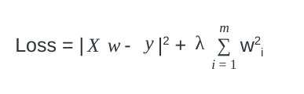

The loss function is modified by adding the shrinkage quantity as a penalty term.  The weight parameters are then estimated by minimizing the modified loss function. λ is the tuning parameter that decides how much we want to penalize the flexibility of our model. Greater the value of the lambda, more shrinkage would occur and the weight parameter tends to take small values leading to less overfitting. However, if lambda is very large then it will introduce bias (underfitting). Ridge regression is sensitive to scale and hence requires all explanatory variables to be in a similar scale.

#### Lasso regression 

LASSO  adds “absolute value of magnitude” of weight parameters (L1 norm) scaled by a regularization parameter as penalty term to the loss function.

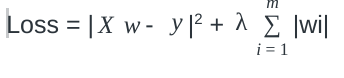

Lasso regression tends to shrink the weight of less important features to zero, thereby removing some features altogether. Ridge regression on the other hand tends to minimize the larger weight parameter into small values due to the squared term in the loss function.

## Logistic regression 

In spite of its name, logistic regression is a model for classification, not regression. It is one of the most widely used machine learning models for binary and multiclass classification.
In case of binary classification of class 1 and 0, logistic regression computes the natural log of the odds that Y is equal to 1 (logit odds), which is simply the ratio of the probability that Y is 1 divided by the probability that Y is 0. 

 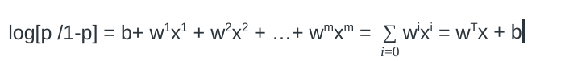
 
,Where p = probability of y being class 1. This formula shows that the logistic regression model is a linear model for the log odds.
Instead of the log odds, we are actually interested in the quantity p, which is estimated by applying a sigmoid or logistic function (inverse form of the logit function) to the quantity in the right hand side of the above equation. The estimated probability of an observation belonging to class 1 is then given by,

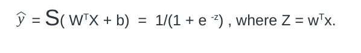

Since the output of the sigmoid function always ranges between 0 and 1, the output value can be interpreted as the conditional probability of an observation belonging to the class. The loss function used in logistic regression is called log loss function, which takes the following form:

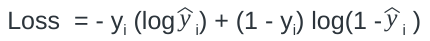

And the cost function over all training examples is given by,

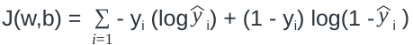

Logistic regression can also be extended from binary classification to multi-class classification. Then it is called Multinomial Regression. Logistic regression is widely used in the industry setting when the interpretability of the model coefficients is the necessity. 

## Naïve Bayes Classifier Algorithm

A Naive Bayes classifier machine learning model is used for classification tasks and based upon Bayes theorem. Bayes theorem from a classification standpoint can be specified in the following form:

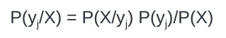

,Where the term in the left side is the probability of a certain class variable (yj) given predictor variables X .

After assuming the independence of all xi variables for a given class, the class probability for class yj can be computed as joint probability of all xi given yj as follows:

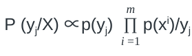
 
Based upon the above, an observation will be assigned a class label that has the greatest conditional probability. Naive Bayes classifiers have found success in problems related to text classification and have been  used in email spam filtering and sentiment analysis problems.

## Tree based algorithms

Tree-based methods are used for both regression and classification problems. Tree based methods recursively stratify or segment the feature space into a number of simple regions ( classes or real value output) using some decision rules •  Since the set of splitting rules used to segment the predictor space can be summarized in a tree, these types of approaches are known as decision-tree methods.

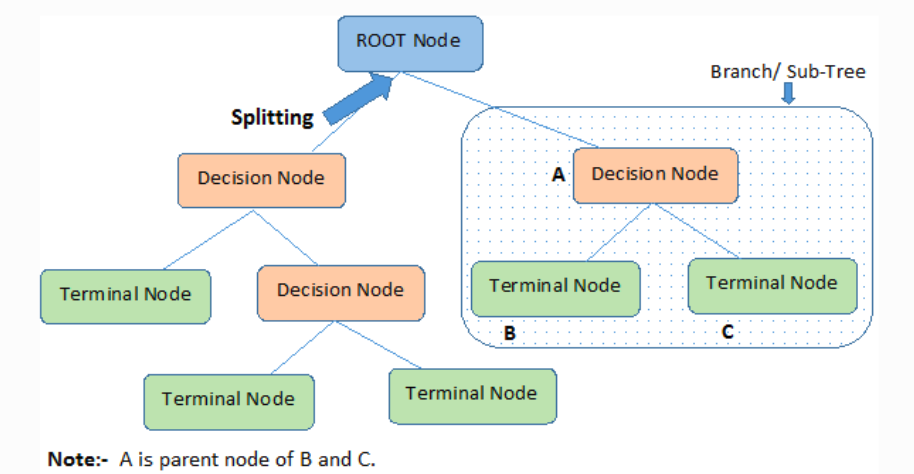

[Source]( https://www.kdnuggets.com/2020/01/decision-tree-algorithm-explained.html)

A decision tree is drawn upside down with its root at the top. The points along the tree where the predictor space is split are referred to as decision or internal nodes. Each decision node checks conditions on a single feature value. The end of the branch that doesn’t split anymore is the terminal node or /leaf.

A high dimensional feature space is partitioned into decision regions using a top-down greedy approach. The approach is considered greedy because at each step of the tree-building process, the best split is made at that particular step, rather than looking ahead and picking a split that will lead to a better tree in some future step.
The splitting the nodes at the most important features on each decision node is done such that the splitting minimizes  the impurities in child nodes compared to parent nodes. In the case of a regression model, mean square error between y and y hat is used as the measure of impurity.

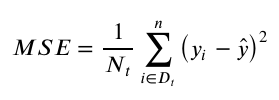

,where Nt is the number of training samples at node t, Dt is the training subset at node t. The MSE thus calculated is also known as node variance and the splitting criterion is better known as variance reduction.
In the classification setting, either Gini index or information gain is used as the measure of impurity of nodes. 
Gini index is defined by, 

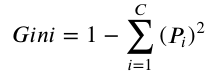

Where _pi_i is the proportion of the samples that belongs to class _c_ for a given node.  A small Gini value indicates that a node contains predominantly observations from a single class.
An alternative to the Gini index is cross-entropy, given by,

Decision trees have a large number of characteristics that make them an attractive option for building prediction models. They can readily accommodate nonlinear responses, variable interactions, both continuous and categorical explanatory variables, and missing values and are relatively unaffected by outliers. Decision trees can also handle large data sets and large numbers of variables and are useful for variable reduction because a measure of the relative importance of the different variables can be calculated. Trees are intuitive and explainable models and closely mirror human decision-making than other machine learning algorithms. However, the predictive ability is typically inferior compared to more advanced machine learning approaches. Ensemble methods  combine multiple trees to yield a single consensus prediction that can often result in major improvements in prediction accuracy, at the expense of some loss interpretation. 

### Bagging

In ensemble learning theory, weak learners (or base models) can be composed together for designing more complex models by combining several of them. Even if  these weak learners do not perform so well by themselves,  the combinations of  several of them together can create strong learners (or ensemble models) that typically achieve better performances.
Bagging is  a general purpose ensemble method in which predictions from several individual weak learners are averaged to obtain a model with lower variance. Fitting several models with independent data, however, requires a large amount of training data sets. Instead of independent samples, bagging methods employ repeated samples from the training data set using bootstrap methods. Each bootstrapped sample acts as almost independent samples drawn from true distribution. Decision trees are then repeatedly fit to bootstrapped subsets of the observations.

In regression tasks, the outputs of individual models can be averaged to obtain the output of the ensemble model. For classification problems, either the most common label or the average of the  class probabilities outputted by individual learners can be used to determine the class label.

### Random Forest

Random forest uses bootstrapping to select samples that are then subjected to model fitting, but only a small number of randomly selected features are used to find the best split at each node. Thus  random forests provide an improvement over bagging by using the additional trick that helps decorrelate the individual trees. When growing an individual tree over bootstrapped samples, a random selection of predictors is chosen as split candidates from the full set of  predictors. The sampling over features further reduces the correlation between the outputs of the trees grown on bootstrapped samples and thereby reduces the variance.

### Boosting

Boosting is another general purpose ensemble method that can, in principle, be applied to different machine learning techniques. While with bagging, decision trees were fitted to each bootstrapping samples independent of each other, trees are grown sequentially one at a time using information from previously grown trees in boosting so that the new tree corrects errors from the previously trained tree.

General tree boosting algorithms, like AdaBoost, correct these errors by increasing the weight of observations that were previously misclassified. The second classifier will likely get some other samples wrong and the weights are adjusted accordingly.

Gradient boosting corrects these errors by sequentially building many small trees to model the pattern in residuals from the previous iteration until no more pattern exists in the residuals. The modelled residuals are added back to the existing model. The addition of  residual predicted by a weak model to an existing model's approximation nudges the model towards the correct target. 
 
### K-Means algorithm

K-means is a clustering algorithm that seeks to learn and find similar groups or patterns in a dataset in an unsupervised manner i.e. without the aid of explicit labels.

The k-means algorithm searches for a predetermined number of clusters by randomly initializing the centroids of K clusters. The algorithm then iteratively works to assign each data point to one of K groups based on the features that are provided. A point is considered to be in a particular cluster if it is closer to that cluster's centroid than any other centroid. After each iteration, the new cluster centroids are recalculated until convergence.

The proximity to the cluster center is determined by a distance measure.  Euclidean distance is the most popular for real valued inputs, but there are a whole bunch of other distance measures such as Mahalanobis distance, cosine distance etc. The appropriate distance metric is chosen based upon the properties of the data. When the features are not greatly correlated  and the values are standardized, Euclidean distance works well. Mahalanobis distance uses covariance in its formulation and could be appropriate when the features are highly correlated.

One major challenge with K-mean clustering is to pick an optimal number of clusters. There are many methods to identify the optimal number of clusters among which the elbow, silhouette and gap statistic based methods are most popular.

